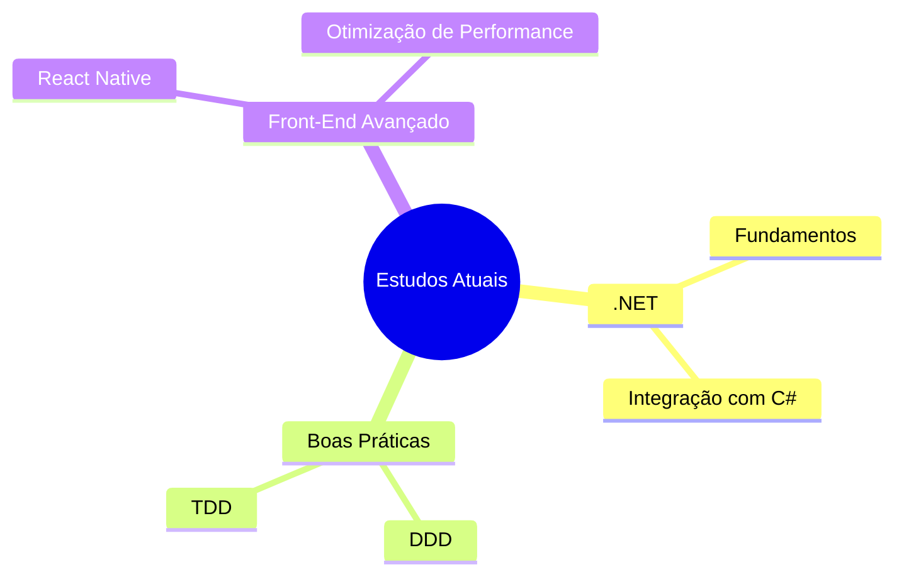

<div align="center">

<!-- BANNER DE ABERTURA (Capsule Render) -->


<!-- TYPING ANIMATION -->
<a href="#">
  
</a>

<br/>

<!-- BADGES SOCIAIS / CONTATO -->
<p>
  <a href="https://www.linkedin.com/in/felipe-fernandes" target="_blank">
    
  </a>
  <a href="mailto:fernandesfelipe.dev@gmail.com">
    
  </a>
  <a href="https://github.com/FelipeFernandes7" target="_blank">
    
  </a>
</p>

<!-- BADGES DE STATUS -->
<p>
  
  
  
  
</p>

</div>

<br/>

<!-- ================================================== -->
<!-- SOBRE MIM -->
<!-- ================================================== -->

## 👋 Sobre Mim


Sou **Felipe Fernandes**, Software Developer com experiência em **React.js** e **Next.js** em ambiente corporativo, especializado na construção de **interfaces escaláveis** e integração com **APIs REST**.

Meu foco está em **performance**, **arquitetura de componentes** e boas práticas de desenvolvimento com **TypeScript**. Complemento minha atuação no front-end com experiência em back-end utilizando **NestJS**, aplicando princípios de **DDD (Domain-Driven Design)** e **TDD (Test-Driven Development)** para construir APIs bem estruturadas e testáveis.

Sou formado em **Técnico em Análise e Desenvolvimento de Sistemas** pela Etec Antônio de Pádua Cardoso, e venho me aprofundando continuamente através de cursos complementares em React avançado e lógica de programação.

**O que me move:**

- 🔭 Construir interfaces performáticas e bem arquitetadas, sem abrir mão da qualidade no back-end.
- 🧠 Aplicar DDD e TDD para escrever APIs estruturadas, testáveis e fáceis de manter.
- 🤝 Colaborar na definição de fluxos de aplicação e regras de negócio junto a times de produto.
- 🎯 Evoluir continuamente como desenvolvedor Full Stack, aprofundando conhecimento em back-end e cloud.

**Minha forma de trabalhar:**

> Entender o fluxo e as regras de negócio antes de codar, estruturar a arquitetura com cuidado e entregar interfaces e APIs que unam boa performance a código bem organizado.

<br clear="right"/>

---

<!-- ================================================== -->
<!-- TECH STACK -->
<!-- ================================================== -->

## 🛠️ Tech Stack

### Front-End

<p align="left">
  
</p>


<br/>

### Back-End

<p align="left">
  
</p>


-512BD4?style=for-the-badge&logo=dotnet&logoColor=white)

**Metodologias e práticas:** DDD (Domain-Driven Design) • TDD (Test-Driven Development) • Arquitetura de Software

<br/>

### Banco de Dados

<p align="left">
  
</p>


<br/>

### Cloud & Ferramentas

<p align="left">
  
</p>


---

<!-- ================================================== -->
<!-- ESPECIALIDADES -->
<!-- ================================================== -->

## 🎯 Especialidades

<table>
<tr>
<td width="50%" valign="top">

**Front-End**
- ✔ Construção de interfaces escaláveis
- ✔ Arquitetura de componentes
- ✔ Integração com APIs REST
- ✔ Otimização de performance
- ✔ React Native (mobile)

</td>
<td width="50%" valign="top">

**Back-End & Arquitetura**
- ✔ APIs REST estruturadas e testáveis
- ✔ Domain-Driven Design (DDD)
- ✔ Test-Driven Development (TDD)
- ✔ ORM (Prisma e KnexJS)
- ✔ Definição de fluxo de aplicação e regras de negócio

</td>
</tr>
</table>

---

<!-- ================================================== -->
<!-- EXPERIÊNCIA -->
<!-- ================================================== -->

## 💼 Experiência

```
Desenvolvedor Full Stack (Front-End)                          Jun/2024 — Atual
  • Reformulação completa da interface de uma aplicação de gestão de
    condomínios, modernizando o layout e aprimorando a performance.
  • Contribuição no desenvolvimento back-end, aplicando conceitos de DDD.
  • Tecnologias: NestJS, TypeScript, PostgreSQL.

Desenvolvedor Full Stack                                  Mai/2022 — Jul/2023
  • Desenvolvimento de aplicativo interno para gerenciamento e registro
    de ponto de colaboradores.
  • Participação na definição do fluxo da aplicação e implementação das
    regras de negócio no back-end.
  • Estruturação da arquitetura do sistema.
```

---

<!-- ================================================== -->
<!-- EDUCAÇÃO & CURSOS -->
<!-- ================================================== -->

## 🎓 Educação & Cursos Complementares

**Técnico em Análise e Desenvolvimento de Sistemas**
Etec Antônio de Pádua Cardoso — Fev/2021 – Jul/2022

**React Advanced — Udemy**
Hooks avançados • Padrões de componentização • Otimização de performance

**Lógica de Programação — Udemy**
Estruturas condicionais e de repetição • Algoritmos • Resolução de problemas

---

<!-- ================================================== -->
<!-- GITHUB ANALYTICS -->
<!-- ================================================== -->

## 📊 GitHub Analytics

<div align="center">


<br/>


<br/>


</div>

---

<!-- ================================================== -->
<!-- ATUALMENTE ESTUDANDO -->
<!-- ================================================== -->

## 📚 Atualmente Estudando



---

<!-- ================================================== -->
<!-- OBJETIVOS -->
<!-- ================================================== -->

## 🎯 Objetivos

Busco continuar evoluindo como desenvolvedor Full Stack, aprofundando meu domínio em **arquitetura de back-end**, aplicando cada vez mais **DDD** e **TDD** na construção de APIs robustas e bem testadas. Também estou expandindo meu conhecimento para o ecossistema **.NET** e para soluções em **nuvem (AWS)**, com o objetivo de atuar em projetos que unam interfaces performáticas a back-ends escaláveis e bem estruturados.

---

<!-- ================================================== -->
<!-- CONTATO -->
<!-- ================================================== -->

## 📬 Contato

<div align="center">

<a href="https://www.linkedin.com/in/felipe-fernandes" target="_blank">
  
</a>
<a href="mailto:fernandesfelipe.dev@gmail.com">
  
</a>
<a href="https://github.com/FelipeFernandes7" target="_blank">
  
</a>

</div>

---

<!-- ================================================== -->
<!-- FOOTER -->
<!-- ================================================== -->

<div align="center">

### "Interfaces performáticas, back-ends bem estruturados — código pensado para durar."


</div>
